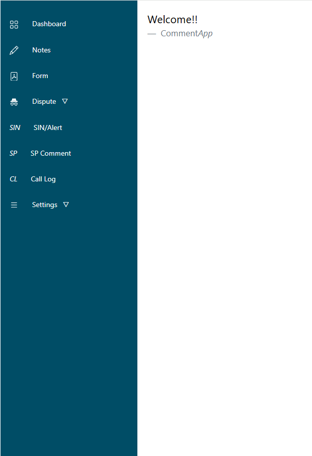
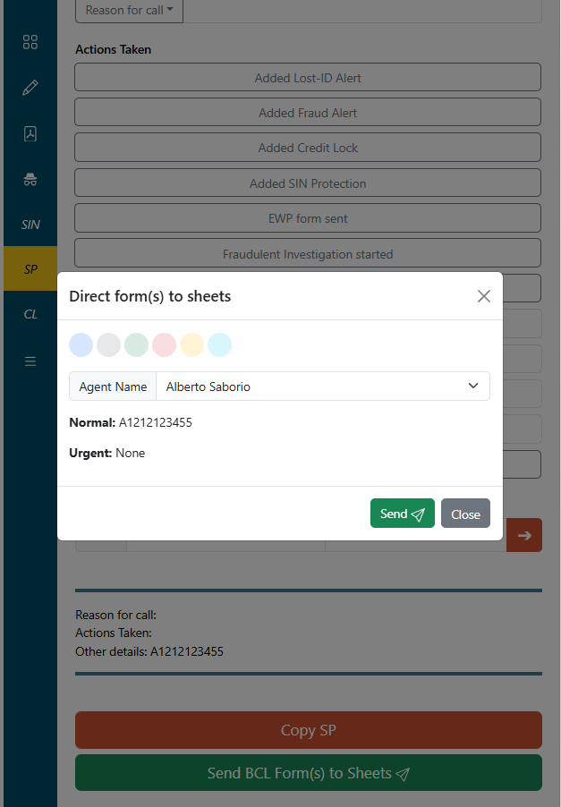
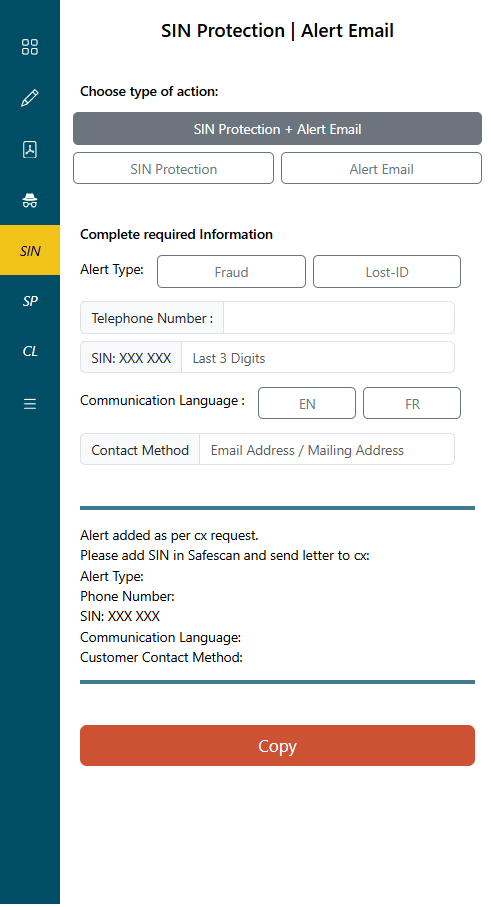

# Bto1790.github.io

# 🚀 CommenApp

> Create templates and comments with a click of a button.





---

## 📝 Description
This application was created to assist call center agents in a company. The purpose is to speed up the call and documentation process. It creates templates or comments depending on the options the user chooses or the information entered into the inputs. These templates are then used to document forms, investigations, protections, etc, in other production area applications. It essentially transforms the information received and updates it into a required template according to the situation, speeding up the call and the documentation process since the user does not have to create the templates manually. It effectively automates the process of documentation and standardizes the comments from all agents.

It also sends ticket numbers to a Google Sheet connected through Apps Script.

## 🛠️ Tech Stack
* **Frontend:** HTML, CSS, JS (MVC architecture)
* **Backend:** Google Apps Script (GAS)
* **Hosting:** Google Apps Script (GAS)

## ⚙️ Getting Started
These instructions will get you a copy of the project up and running on your local machine. The repository does not include the backend files.

### Prerequisites
* [Node.js](https://nodejs.org/) installed
* npm or yarn

### Installation
1. Clone the repo
   ```sh
   git clone https://github.com/Bto1790/commentApp.git
   ```
2. Install dependencies
   ```sh
   npm install
   npm init -y
   npm i bootstrap@5.3.8
   npm i --save bootstrap @popperjs/core
   ```
### Running the App
Run in localhost

## 👨‍💻 Author
**Alberto Saborio Gonzalez**
* [GitHub](https://github.com/Bto1790)
* [LinkedIn](https://www.linkedin.com/in/alberto-s-a3062a1a9/)

## 📄 License
This project is licensed under the MIT License - see the LICENSE file for details.
